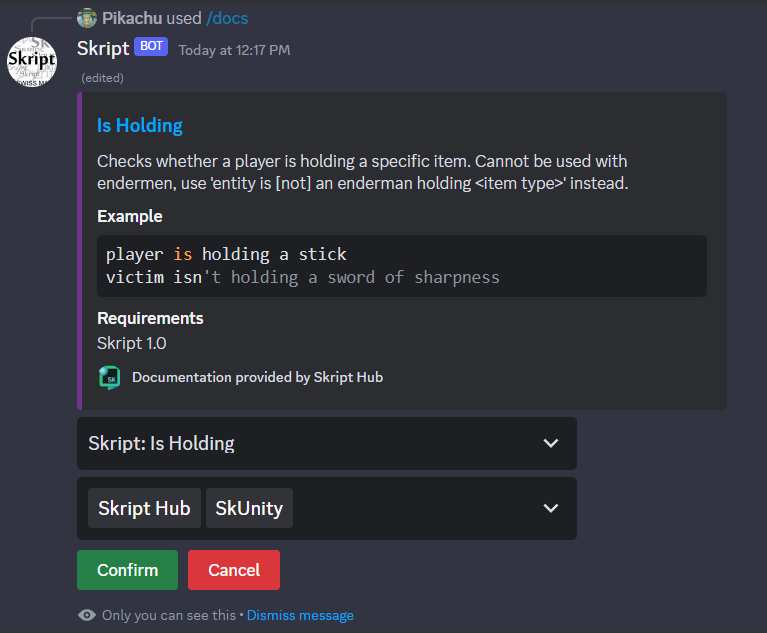

# skript-doc-bot

skript-doc-bot is a Discord bot that provides quick access
to Skript documentation from the most popular documentation sites
(currently SkUnity and Skript Hub).

## Configuration

In order to run the bot, you will need to set the following
environment variables:
- `SKRIPT_SKRIPTHUB_TOKEN`: Your Skript Hub API token
- `SKRIPT_SKUNITY_KEY`: Your SkUnity API key
- `SKRIPT_DISCORD_TOKEN`: Your bots Discord token
- `SKRIPT_DATA_PATH`: The path to store the bot data at
